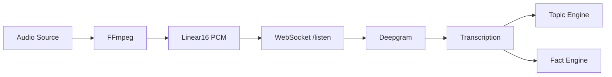

# Audio Testing Guide

## Problem with Original test_client.py

The original `test_client.py` was trying to send JSON text messages to the `/listen` WebSocket endpoint:

```python
# ❌ WRONG - Endpoint expects binary audio, not JSON
await websocket.send(json.dumps({"type": "transcript", "text": "..."}))
```

**Error:** `no close frame received or sent`

**Why?** The `/listen` endpoint is designed to:
1. Receive binary audio data (linear16 PCM format)
2. Forward it to Deepgram for transcription
3. Return transcription results as JSON

It does NOT accept text transcripts directly.

## Solution: Use FFmpeg for Audio Conversion

The new `test_audio_client.py` properly converts audio to the expected format.

## Using test_audio_client.py

### 1. Verify FFmpeg Installation

The script expects FFmpeg at:
```
C:\Users\loizi\PycharmProjects\ffmpeg\bin\ffmpeg.exe
```

If your FFmpeg is elsewhere, edit this line in `test_audio_client.py`:
```python
FFMPEG_PATH = r"C:\Users\loizi\PycharmProjects\ffmpeg\bin\ffmpeg.exe"
```

### 2. Run the Test

```bash
python test_audio_client.py
```

### 3. Choose Test Mode

**Option 1: Stream from BBC World Service** (recommended)
- Streams live audio from BBC radio
- Real speech → real transcriptions
- Tests full pipeline

**Option 2: Generate test tone**
- Generates sine wave audio
- No transcriptions expected (not speech)
- Tests audio streaming only

### 4. Expected Output

```
Real-Time Podcast AI Assistant - Audio Test Client
==================================================

✓ FFmpeg found at: C:\Users\loizi\PycharmProjects\ffmpeg\bin\ffmpeg.exe

Select test mode:
1. Stream from BBC World Service (live audio)
2. Generate test tone (no transcription expected)

Enter choice (1 or 2, default=1): 1

Connecting to ws://localhost:8000/listen...
✓ Connected to server
Starting audio stream from: http://stream.live.vc.bbcmedia.co.uk/bbc_world_service
✓ Starting FFmpeg audio conversion...
✓ Streaming audio data to server...
==================================================
Listening for transcriptions (Press Ctrl+C to stop)...
==================================================

🎤 FINAL [0.95] This is BBC World Service
⏸️  PARTIAL [0.82] with the latest news from
🎤 FINAL [0.91] with the latest news from around the world

📊 Topic Update: News Broadcasting (Total: 1)

🔍 Fact check queued: This is BBC World Service...
```

## How It Works



### FFmpeg Conversion

```bash
ffmpeg -i <source> \
  -f s16le \      # 16-bit little-endian PCM
  -ar 16000 \     # 16kHz sample rate
  -ac 1 \         # Mono
  -
```

### Chunk Size

The script sends audio in ~80ms chunks (2560 bytes):
- 16kHz sample rate
- 16-bit samples = 2 bytes per sample
- 1 channel (mono)
- 80ms = 0.08 seconds

Calculation: `16000 samples/sec × 2 bytes/sample × 0.08 sec = 2560 bytes`

## Using Your Own Audio

### From a File

Edit `test_audio_client.py`:

```python
# Replace this line:
AUDIO_SOURCE = "http://stream.live.vc.bbcmedia.co.uk/bbc_world_service"

# With:
AUDIO_SOURCE = r"C:\path\to\your\audio.mp3"
```

FFmpeg will automatically convert any audio format (MP3, WAV, M4A, etc.) to linear16 PCM.

### From Microphone

```python
# Windows microphone
AUDIO_SOURCE = "audio=Microphone"

# Update FFmpeg command to use dshow
ffmpeg_cmd = [
    FFMPEG_PATH,
    '-f', 'dshow',          # DirectShow input (Windows)
    '-i', AUDIO_SOURCE,
    '-f', 's16le',
    '-ar', '16000',
    '-ac', '1',
    '-'
]
```

## Troubleshooting

### FFmpeg Not Found

```
❌ FFmpeg not found at: C:\Users\loizi\PycharmProjects\ffmpeg\bin\ffmpeg.exe
```

**Fix:** Update `FFMPEG_PATH` in the script to point to your ffmpeg.exe

### No Transcriptions Appearing

1. **Check Deepgram API key** in `.env`
2. **Check audio source** - Is it playing audio?
3. **Check server logs** for Deepgram errors

### Connection Closed Immediately

1. **Check server is running**: `python main.py`
2. **Check API key is valid**
3. **Look at server console** for error messages

### Audio Playing But No Transcriptions

The audio source might not contain speech:
- Test tone (Option 2) won't transcribe (it's not speech)
- Silent audio won't produce transcriptions
- Very low volume might not be detected

**Try:** Use BBC World Service (Option 1) which always has speech

## Original test_client.py

The original `test_client.py` now only tests REST API endpoints:
- `/` - Health check
- `/stats` - Statistics
- `/topics` - Topic timeline
- `/facts` - Fact results

It will display a warning that WebSocket testing requires audio:

```bash
python test_client.py

# Output:
⚠️  TEXT-BASED TESTING NOT SUPPORTED
The /listen endpoint requires binary audio data (linear16 PCM).

Please use: python test_audio_client.py
```

## Summary

| Test Client | Purpose | Audio Required | FFmpeg Required |
|-------------|---------|----------------|-----------------|
| `test_client.py` | Test REST APIs only | No | No |
| `test_audio_client.py` | Full pipeline test | Yes | Yes |

For full end-to-end testing, always use `test_audio_client.py`! 🎙️
